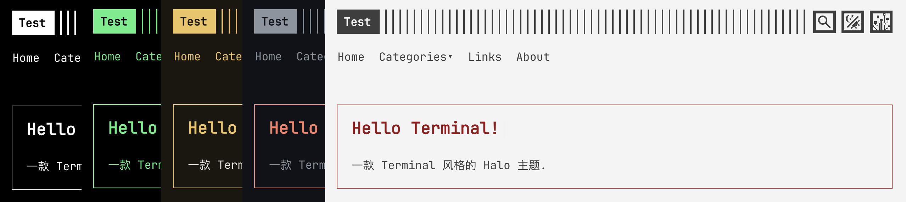

# Halo Terminal

一款 Terminal 风格的 Halo 主题

基于 wan92hen 的 [Terminal](https://github.com/wan92hen/theme-terminal) 修改

前往: https://erzbir.com 查看

## 特色功能

- 亮暗模式自选预设配色
- 搜索组件配色适配
- 评论组件配色适配
- 错误页适配
- 像素化开关
- 子菜单

## 计划

- [ ] 自定义配色
- [ ] 全站像素化
- [ ] 支持移动端 TOC
- [ ] 调整代码高亮
- [ ] 本地化

## 自行构建

在项目目录使用 `make` 命令来构建 (确保有 `pnpm` 和 `npx` 命令)

`make` 成功后, 构建产物在 `build` 目录

## 原主题

- [Terminal](https://github.com/wan92hen/theme-terminal)
- [Hugo Terminal](https://github.com/panr/hugo-theme-terminal)
