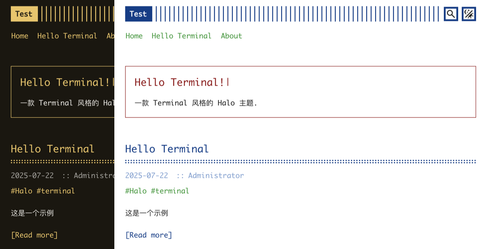

# Halo Terminal

一款 Terminal 风格的 Halo 主题

基于 wan92hen 的 [Terminal](https://github.com/wan92hen/theme-terminal) 修改

前往: [demo](https://erzbir.com)

## 特性
- [x] 首页公告
- [x] 评论
- [x] 友链
- [x] 瞬间
- [x] 错误页
- [x] 像素化
- [x] 亮暗模式自选预设配色
- [x] 搜索组件适配主题
- [x] 评论配色适配主题

## 计划
- [ ] 自定义配色
- [ ] 像素化开关
- [ ] 全站像素化
- [ ] 支持移动端 TOC

## 自行构建
在项目目录使用 `make` 命令来构建 (确保有 `pnpm` 和 `npx` 命令)

`make` 成功后, 构建产物在 `build` 目录

## 原主题
- [Hugo Terminal](https://github.com/panr/hugo-theme-terminal)
- [Terminal](https://github.com/wan92hen/theme-terminal)
