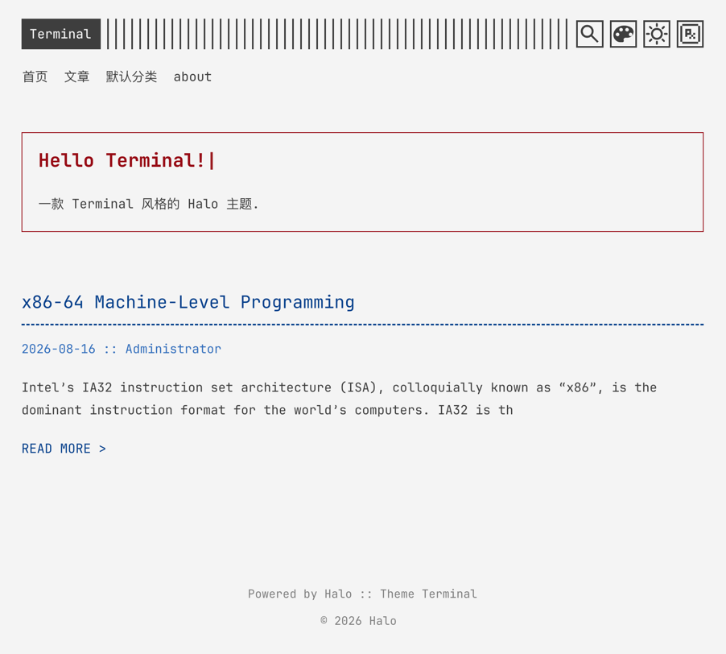

# Terminal-EZ

一款简洁, 复古的 Terminal 风格 Halo 主题




## 功能

- Terminal 风格的响应式页面布局
- 浅色, 深色和跟随系统 3 种外观模式, 页头按钮会显示太阳, 月亮或圆圈图标
- 12 套内置配色和多套自定义配色
- 可排序的页头功能按钮, 支持搜索, 配色选择, 外观切换, 像素化和自定义功能
- 常规图标和像素图标切换
- 内置 JetBrains Mono, Hack 和 Fira Code 字体, 也可使用访客系统字体
- 支持多字体 fallback, PostScript Name 本地匹配和高级 `@font-face` 配置
- 基础行高, 文章段落间距和文章元信息分隔符配置
- 首页公告打字效果
- 文章目录和目录展开状态配置
- 文章标签, 置顶标记和上一篇/下一篇导航
- Halo 评论组件适配
- Halo 搜索组件适配
- PJAX 页面切换
- 多级菜单
- 社交资料和 RSS
- ICP 备案和公安备案信息
- 首页, 文章, 独立页面, 归档, 分类, 标签, 友链和错误页模板
- 瞬间, 朋友圈和项目作品集页面模板
- 英文, 简体中文, 繁体中文和西班牙文界面文本

## 页面和集成

| 页面或功能     | 模板或条件                                                                  |
|-----------|------------------------------------------------------------------------|
| 首页        | `templates/index.html`                                                 |
| 文章页       | `templates/post.html`                                                  |
| 独立页面      | `templates/page.html`                                                  |
| 归档页       | `templates/archives.html`                                              |
| 分类列表和分类详情 | `templates/categories.html`, `templates/category.html`                 |
| 标签列表和标签详情 | `templates/tags.html`, `templates/tag.html`                            |
| 友链页       | `templates/links.html`                                                 |
| 朋友圈       | `templates/friends.html`, 需要朋友圈插件                                      |
| 瞬间        | `templates/moments.html`, 需要瞬间插件                                       |
| 项目作品集     | `templates/portfolio.html`, `templates/portfolio-detail.html`, 需要作品集插件 |
| 搜索        | 搜索组件可用且开启页头搜索按钮时显示                                                     |
| 评论        | 启用评论插件并开启评论功能时显示评论组件                                                   |
| 错误页       | 提供 `404`, `5xx` 和通用错误模板                                                |

## 主题设置

### 通用设置

| 设置    | 配置名                                               | 说明                      |
|-------|---------------------------------------------------|-------------------------|
| 时间格式  | `general.time_style`, `general.custom_time_style` | 支持预设格式或自定义 Java 时间格式字符串 |
| 偏好有效期 | `general.prefer_ttl`                              | 访客偏好的保存小时数, `0` 表示永久保存  |
| PJAX  | `general.pjax_enable`                             | 默认关闭, 开启后站内链接只更新主要内容    |

访客手动选择的外观模式, 配色和像素风格会保存在浏览器的 `localStorage` 中. 默认有效期为 24 小时,
偏好过期后会在下次访问时恢复主题默认值. 已有但没有过期时间的偏好会在升级后的首次访问时开始计算有效期.

### 页头

| 设置      | 配置名              | 说明                  |
|---------|------------------|---------------------|
| Logo 文本 | `header.logo`    | 留空时使用 Halo 站点标题     |
| 功能按钮    | `header.buttons` | 按数组顺序展示内置按钮和自定义功能按钮 |

`header.buttons` 默认包含搜索, 外观切换和像素化按钮. 在数组中添加, 删除或拖动条目即可控制按钮的显示与顺序;
搜索按钮仅在搜索组件插件可用时展示. 内置按钮可自定义普通和像素风格图标, 留空时使用主题内置图标.

自定义功能按钮需设置按钮名称, `onclick` JavaScript 和图标; 可选的像素风格图标留空时使用普通图标. `onclick` 中可使用
`event` 和 `this`; 代码会在访客点击按钮时执行, 只应填写可信任的 JavaScript.

外观切换顺序为 `浅色 -> 深色 -> 跟随系统`; 图标依次为太阳, 月亮和圆圈. 切换外观模式时会清除访客单独选择的配色,
让浅色和深色模式重新使用主题设置中对应的方案.

### 字体与排版

| 设置    | 配置名                                 | 说明                                     |
|-------|-------------------------------------|----------------------------------------|
| 默认字体  | `typography.default_font`           | 系统字体, JetBrains Mono, Hack 或 Fira Code |
| 自定义字体 | `typography.custom_font_enable`     | 启用自定义字体列表                              |
| 字体列表  | `typography.custom_fonts`           | 按顺序组成字体 fallback                       |
| 字体大小  | `typography.font_size`              | 接受 `16px`, `1rem` 等 CSS 长度             |
| 行高    | `typography.line_height`            | 接受 CSS 长度或 `calc(...)`                 |
| 段落间距  | `typography.post_paragraph_spacing` | 控制文章正文段落的上下间距                          |

每项自定义字体可以填写字体名称, PostScript Name, 字体文件和格式. 浏览器会先用 PostScript Name
匹配本地字体, 未命中时再加载文件. 高级设置支持字重, 样式, Unicode 范围, 显示策略, OpenType 特性,
可变字体轴和字体度量覆盖等 `@font-face` 描述符.

字体优先级如下:

1. 开启像素风格时使用内置 `Fusion Pixel 12px Prop zh_hans`
2. 未开启像素风格且启用自定义字体时, 按自定义字体列表顺序组成 fallback
3. 其他情况使用“默认字体”中选择的内置字体或 `system-ui`

### 布局

| 设置     | 配置名                        | 说明                          |
|--------|----------------------------|-----------------------------|
| 全屏布局   | `layout.fullscreen_layout` | 正文使用全部可用宽度                  |
| 正文最大宽度 | `layout.max_width`         | 接受 `960px`, `80vw` 等 CSS 长度 |
| 正文内边距  | `layout.content_padding`   | 同时控制桌面端和移动端正文内边距            |
| 媒体最大宽度 | `layout.media_max_width`   | 全屏布局中控制图片, 视频和 `figure` 宽度  |
| 表格铺满正文 | `layout.table_full_width`  | 让正文中的表格宽度为 `100%`           |

### 配色

| 设置    | 配置名                                 | 说明              |
|-------|-------------------------------------|-----------------|
| 默认外观  | `color_scheme.default_appearance`   | 可选浅色, 深色或跟随系统   |
| 浅色方案  | `color_scheme.light_color_scheme`   | 浅色模式使用的内置或自定义配色 |
| 深色方案  | `color_scheme.dark_color_scheme`    | 深色模式使用的内置或自定义配色 |
| 自定义方案 | `color_scheme.custom_color_schemes` | 添加多套自定义配色       |

浅色或深色方案选择 `custom` 时, 分别通过 `color_scheme.custom_light_scheme` 或
`color_scheme.custom_dark_scheme` 填写自定义方案 ID. 自定义方案至少需要 ID, 背景色, 主文本色和基础强调色;
高级颜色设置可以覆盖辅助文字, 强调文字, 标签文字, 链接文字, 导航, 控件, 边框, 选中背景, 光标和代码颜色.

访客配色列表会从页面样式表中自动发现 `html[data-theme-color-scheme='name']` 选择器. 列表中的 `default`
用于清除访客选择并恢复当前外观模式对应的主题方案, 因此不要将 `default` 用作自定义配色 ID.

### 全局样式

| 设置     | 配置名                                                                  | 说明                                                |
|--------|----------------------------------------------------------------------|---------------------------------------------------|
| 默认像素风格 | `global_style.pixel_style`                                           | 使用像素字体和像素图标                                       |
| 列表标记   | `global_style.list_style`                                            | 接受 CSS `list-style` 值                             |
| 通用边线   | `global_style.border_width`, `global_style.border_style`             | 控制通用边线宽度和样式                                       |
| 表格边线   | `global_style.table_border_width`, `global_style.table_border_style` | 控制表格边线宽度和样式                                       |
| 标题分隔线  | `global_style.title_divider_style`                                   | 可选 `solid`, `dashed`, `dotted`, `double` 或 `none` |
| 元信息分隔符 | `global_style.post_meta_divider`                                     | 控制时间, 作者和标签等元信息之间的分隔符                             |

### 高级设置

`advanced.custom` 用于填写自定义 CSS. 内容会写入页面 `<head>` 中并在主题主样式之后生效.

### 页面设置

| 页面  | 可配置内容                             |
|-----|-----------------------------------|
| 首页  | 公告标题, 公告内容, 社交资料, 置顶图标, 图标位置和文章标签 |
| 文章页 | 文章目录, 目录默认状态和文章标签                 |
| 归档页 | 页面标题, 文章标签, 分页和年份展开模式             |
| 分类页 | 分类列表标题和分类详情标题                     |
| 标签页 | 标签列表标题和标签详情标题                     |
| 友链页 | 页面标题                              |

文章目录会读取正文中的 `h1` 到 `h4`, `auto` 模式在普通布局中默认展开, 在全屏布局中默认收起, 目录也会根据浏览器宽度和正文右侧空间调整位置.

### 社交资料

首页可以添加任意社交资料. 每项资料可配置普通图标, 像素风格图标, 名称和链接; 链接支持
`http://`, `https://`, `mailto:` 和 `tel:`. RSS 可单独开启.

### 备案信息

页脚支持 ICP 备案号, ICP 跳转链接, 公安备案号和公安备案跳转链接

## 内置配色

| 名称          | 背景色       | 主文本色      | 基础强调色     |
|-------------|-----------|-----------|-----------|
| `day`       | `#f4f4f4` | `#3e3e3e` | `#003e8a` |
| `night`     | `#101216` | `#8b949e` | `#6ca4f8` |
| `niello`    | `#1a170f` | `#eceae5` | `#eec35e` |
| `matrix`    | `#000000` | `#4eee85` | `#4eee85` |
| `ink`       | `#121212` | `#c3c3c3` | `#ffffff` |
| `paper`     | `#ffffff` | `#1b1b1b` | `#000000` |
| `hopbush`   | `#fff6f6` | `#462d2d` | `#cc6099` |
| `pistachio` | `#1d2021` | `#ebdbb2` | `#8ec07c` |
| `blue`      | `#153489` | `#eceae5` | `#5ea5ee` |
| `vanilla`   | `#fff4f2` | `#424140` | `#8f6a5e` |
| `studio`    | `#f7f4ff` | `#403352` | `#6f49ab` |
| `blood`     | `#221f29` | `#ffffff` | `#ff6266` |

`day` 和 `night` 对弱化文字, 标签, 强调边框, 动态光标, 导航和控件使用了额外的语义颜色;
其他配色默认从主文本色和基础强调色派生这些角色.

`ink` 使用 `#5ac8fa` 链接色, `#c1c1c1` 弱化色和 `#1f1f1f` 行内代码背景;
`paper` 使用 `#406ed2` 链接色, `#595959` 弱化色和 `#ebebeb` 行内代码背景

## 自定义 CSS

在主题设置的 `高级设置 -> 自定义 CSS` 中填写原始 CSS. 自定义内容在主题主样式之后加载, 可以覆盖内置规则.

### 新增自定义配色

下面的示例增加名为 `forest` 的配色:

```css
html[data-theme-color-scheme='forest'] {
    --color-theme-background: #0f1a14;
    --color-theme-text: #c7d8cc;
    --color-theme-accent: #68d391;

    /* Optional semantic colors */
    --color-theme-text-muted: #81a88d;
    --color-theme-text-accent: #8fe3a8;
    --color-theme-text-label: #9ae6b4;
    --color-theme-border-emphasis: #48bb78;
    --color-theme-navigation: #c7d8cc;
    --color-theme-control: #68d391;
    --color-theme-caret: #48bb78;
}
```

保存后可以使用以下任一方式启用:

1. 在 `深色方案` 或 `浅色方案` 中选择 `custom`, 再填写 ID `forest`
2. 开启 `展示配色切换按钮`, 然后由访客在页头选择 `forest`

### 覆盖内置配色

直接使用内置配色名称即可覆盖对应变量:

```css
html[data-theme-color-scheme='matrix'] {
    --color-theme-background: #07130b;
    --color-theme-text: #7dff9b;
    --color-theme-accent: #39ff68;
}
```

### 常用颜色变量

| 变量                              | 用途                  |
|---------------------------------|---------------------|
| `--color-theme-background`      | 页面和基础背景             |
| `--color-theme-text`            | 正文和主要文字             |
| `--color-theme-text-secondary`  | 摘要, 插件等辅助文字         |
| `--color-theme-text-muted`      | 时间, 作者, 占位符等弱化文字    |
| `--color-theme-text-inverse`    | 强调色填充背景上的文字         |
| `--color-theme-accent`          | 基础强调色, 用于填充和焦点等强调基础 |
| `--color-theme-text-accent`     | 标题, 按钮文字等强调文字       |
| `--color-theme-text-label`      | 标签和技术标记文字           |
| `--color-theme-text-link`       | 普通链接文字              |
| `--color-theme-accent-muted`    | 中等强度强调色             |
| `--color-theme-accent-subtle`   | 低强度强调色              |
| `--color-theme-navigation`      | 主导航文字               |
| `--color-theme-control`         | 页头控件和 Logo          |
| `--color-theme-surface`         | 代码块和组件表面            |
| `--color-theme-surface-strong`  | 对比度更高的代码和控件表面       |
| `--color-theme-border`          | 默认边框                |
| `--color-theme-border-muted`    | 低对比度边框              |
| `--color-theme-border-accent`   | 交互元素和内容强调边框         |
| `--color-theme-border-emphasis` | 公告框, 作品卡片等强调边框      |
| `--color-theme-selection`       | 选中文字的背景             |
| `--color-theme-overlay`         | 模态遮罩层               |
| `--color-theme-scrollbar`       | 滚动条                 |
| `--color-theme-code-text`       | 行内代码和代码块文字          |
| `--color-theme-code-background` | 行内代码背景              |
| `--color-theme-caret`           | 打字效果动态光标            |

派生颜色使用 CSS `color-mix()`. 自定义配色通常只需要设置背景色, 主文本色和基础强调色;
相同语义在所有配色中保持一致, 只有确实需要不同视觉层级时才覆盖其他语义变量.

### 常用布局变量

| 变量                                         | 默认值                                     |
|--------------------------------------------|-----------------------------------------|
| `--size-theme-font`                        | `1rem`                                  |
| `--height-theme-line`                      | `calc(var(--size-theme-font) * 1.75)`   |
| `--spacing-theme-post-paragraph`           | `calc(var(--size-theme-font) * 1.25)`   |
| `--content-theme-post-meta-divider`        | `"::"`                                  |
| `--family-theme-font`                      | `'JetBrains Mono'`                      |
| `--list-theme-style`                       | `disc`                                  |
| `--width-theme-border`                     | `calc(var(--size-theme-font) * 0.125)`  |
| `--width-theme-table-border`               | `calc(var(--size-theme-font) * 0.0625)` |
| `--width-theme-media-max`                  | `60%`                                   |
| `--spacing-theme-container-padding`        | `calc(var(--size-theme-font) * 2.5)`    |
| `--spacing-theme-container-padding-mobile` | `calc(var(--size-theme-font) * 1.25)`   |
| `--style-theme-border`                     | `solid`                                 |
| `--style-theme-table-border`               | `dashed`                                |
| `--style-theme-title-divider`              | `dashed`                                |
| `--radius-theme-border`                    | `0`                                     |
| `--text-decoration-theme-link`             | `none`                                  |
| `--text-decoration-theme-post-link`        | `var(--text-decoration-theme-link)`     |
| `--weight-theme-inline-code`               | `inherit`                               |
| `--lig-theme-font`                         | `none`                                  |
| `--width-theme-scrollbar`                  | `thin`                                  |

修改特定配色下的字体:

```css
html[data-theme-color-scheme='matrix'] {
    --family-theme-font: system-ui;
}
```

修改全局行高:

```css
:root {
    --height-theme-line: calc(var(--size-theme-font) * 1.7);
}
```

## PJAX

PJAX 默认关闭, 开启后站内 `a[data-pjax]` 链接会更新以下区域:

- `<head>` 中的 `<title>`
- `.content`
- `.ex-pjax`

`a[data-pjax]` 用于触发 PJAX 导航. `.ex-pjax` 是额外的内容替换区域, 需要确保当前页面和目标页面都存在对应元素.

```html

<div class="ex-pjax">
    Dynamic content
</div>
```

如果要注入 `<script>` 或 `<link rel="stylesheet">`, 根据插入的位置需要为标签添加一些属性才能保证行为正常

- `<head>`: 重新执行所有请求页面新插入的无 `data-no-pjax` 属性的 `<script>` 和 `<link rel="stylesheet">`
- `<footer>`: 重新执行有 `data-pjax` 属性的 `<script>` 和 `<link rel="stylesheet">`
- `.content`: 重新执行有 `data-pjax` 属性的 `<script>`

设置 `data-no-pjax` 属性, 可以防止被 PJAX 处理

### 已知的问题

动态注入 JS 的时候可能会出现一些问题

- <del>highlightjs 插件的 _复制按扭_ 数量会随页面切换增加</del> (此插件目前已过时)

## 开发和构建

### 环境

项目使用原生 ES 模块, 用 `esbuild` 来构建, 使用 `pnpm` 管理依赖

确保已安装 `nodejs`

### 使用 Make

```shell
make
```

其他目标:

```shell
make install
make build
make test
make clean
```

`make test` 会构建主题, 清理旧的测试目录并将压缩包解压到 `dist/theme-terminal-ez`

### 使用 pnpm

```shell
corepack enable
pnpm install --frozen-lockfile
pnpm build
```

构建产物位于:

```text
dist/theme-terminal-ez-<version>.zip
```

## 原主题

- [Terminal](https://github.com/wan92hen/theme-terminal)
- [Hugo Terminal](https://github.com/panr/hugo-theme-terminal)
